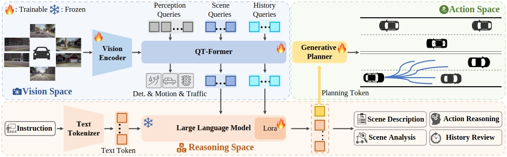

# ORION: A Holistic End-to-End Autonomous Driving Framework by Vision-Language Instructed Action Generation


<a href=""></a>
<a href="https://xiaomi-mlab.github.io/Orion/"></a>

<!-- ## Introduction -->


End-to-end (E2E) autonomous driving methods still struggle to make correct decisions in interactive closed-loop evaluation due to limited causal reasoning capability. Current methods attempt to leverage the powerful understanding and reasoning abilities of Vision-Language Models (VLMs) to resolve this dilemma.  However, the problem is still open that few VLMs for E2E methods perform well in the closed-loop evaluation due to the gap between the semantic reasoning space and the purely numerical trajectory output in the action space. To tackle this issue, we propose **ORION**, a h**O**listic E2E autonomous d**R**iving framework by v**I**sion-language instructed acti**ON** generation.
ORION uniquely combines a QT-Former to aggregate long-term history context, a Large Language Model (LLM) for driving scenario reasoning, and a generative planner for precision trajectory prediction. ORION further aligns the reasoning space and the action space to implement a unified E2E optimization for both visual question-answering (VQA) and planning tasks. Our method achieves an impressive closed-loop performance of 77.74 Driving Score (DS) and 54.62\% Success Rate (SR) on the challenge Bench2Drive datasets, which outperforms state-of-the-art (SOTA) methods by a large margin of 14.28 DS and 19.61\% SR.


<div align="center">

</div>

## News
`[2025/03/22]` [ArXiv]() paper release. Code/Models/Datasets are coming soon. Please stay tuned!


## Currently Supported Features
- [ ] Chat-B2D Dataset 
- [ ] ORION Inference Framework
- [ ] Open-loop Evaluation
- [ ] Close-loop Evalution
- [ ] ORION Checkpoint
- [ ] ORION Training Framework

## Main Results

### Orion and other baselines
The results of UniAD & VAD are refer to the official results of [Bench2DriveZoo](https://github.com/Thinklab-SJTU/Bench2DriveZoo)

| Method | L2 (m) 2s | Driving Score | Success Rate(%) | Eval Json|
| :---: | :---: | :---: | :---: |  :---: |
| UniAD-Tiny |0.80 | 40.73 |  13.18  | [Json](assets/results/UniAD-Tiny.json) |
| UniAD-Base |0.73 | 45.81  |  16.36  | [Json](assets/results/UniAD-Base.json) |
| VAD        |0.91 | 42.35  | 15.00  | [Json](assets/results/VAD.json) |
| ORION       |0.68 | 77.74  | 54.62 | [Json](assets/results/ORION.json) |


## Qalitative visualization & Analysis
We provide some visualization videos and qualitatively analysis for Orion and compared them with TCP-traj, UniAD-Base, VAD-Base at [here](docs/analysis.md). 

## Citation
If this work is helpful for your research, please consider citing:

```
@article{
}
```
