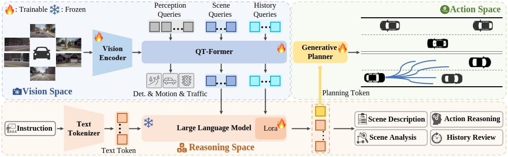

<!-- # ORION: A Holistic End-to-End Autonomous Driving Framework by Vision-Language Instructed Action Generation -->

<div align="center">
<h3>[🎉ICCV 25] ORION: A Holistic End-to-End Autonomous Driving Framework <br>by Vision-Language Instructed Action Generation</h3>

Haoyu Fu<sup>1\*</sup>, Diankun Zhang<sup>2\*</sup>, Zongchuang Zhao<sup>1\*</sup>, Jianfeng Cui<sup>2</sup>, Dingkang Liang<sup>1†</sup>, <br> Chong Zhang<sup>2</sup>, Dingyuan Zhang<sup>1</sup>, Hongwei Xie<sup>2†</sup>,  Bing Wang<sup>2</sup>, Xiang Bai<sup>1</sup>

<sup>1</sup>  Huazhong University of Science & Technology, <sup>2</sup>  Xiaomi EV 

(\*) Equal contribution. (†) Project leader.

<a href="https://arxiv.org/abs/2503.19755"></a>
<a href="https://xiaomi-mlab.github.io/Orion/"></a>
</div>


<!-- ## Introduction -->
## Abstract

End-to-end (E2E) autonomous driving methods still struggle to make correct decisions in interactive closed-loop evaluation due to limited causal reasoning capability. Current methods attempt to leverage the powerful understanding and reasoning abilities of Vision-Language Models (VLMs) to resolve this dilemma.  However, the problem is still open that few VLMs for E2E methods perform well in the closed-loop evaluation due to the gap between the semantic reasoning space and the purely numerical trajectory output in the action space. To tackle this issue, we propose **ORION**, a h**O**listic E2E autonomous d**R**iving framework by v**I**sion-language instructed acti**ON** generation.
ORION uniquely combines a QT-Former to aggregate long-term history context, a Large Language Model (LLM) for driving scenario reasoning, and a generative planner for precision trajectory prediction. ORION further aligns the reasoning space and the action space to implement a unified E2E optimization for both visual question-answering (VQA) and planning tasks. Our method achieves an impressive closed-loop performance of 77.74 Driving Score (DS) and 54.62\% Success Rate (SR) on the challenge Bench2Drive datasets, which outperforms state-of-the-art (SOTA) methods by a large margin of 14.28 DS and 19.61\% SR.

## Overview
<div align="center">

</div>

## News
**`[2026/06/20]`** Our follow-up work **MindDrive**, a closed-loop reinforcement learning VLA model with a smaller model size and faster inference, has been accepted by **ECCV 2026** 🎉🎉🎉! [Paper](https://arxiv.org/pdf/2512.13636) | [Code](https://github.com/xiaomi-mlab/MindDrive)

**`[2025/08/13]`** ORION training code and dataset are now released!

`[2025/06/26]` ORION is accepted by **ICCV 2025**🎉🎉🎉!

`[2025/06/26]` ORION training code and dataset will be released, stay tuned!

`[2025/04/10]` ORION inference code and checkpoint release.

`[2025/03/26]` [ArXiv](https://arxiv.org/abs/2503.19755) paper release.

## Currently Supported Features

- [√] ORION Inference Framework
- [√] Open-loop Evaluation
- [√] Close-loop Evalution
- [√] ORION Checkpoint
- [√] Chat-B2D Dataset 
- [√] ORION Training Framework


## Getting Started

```
git clone https://github.com/xiaomi-mlab/Orion.git
cd ./ORION
conda create -n orion python=3.8 -y
conda activate orion
pip install torch==2.4.1+cu118 torchvision==0.19.1+cu118 torchaudio==2.4.1 --index-url https://download.pytorch.org/whl/cu118
pip install -v -e .
pip install -r requirements.txt

```

## Preperation
You can refer to [here](https://github.com/Thinklab-SJTU/Bench2DriveZoo/blob/uniad/vad/docs/DATA_PREP.md) to prepare the Bench2drive dataset.

ORION uses the pretrained [2D llm weights](https://huggingface.co/exiawsh/pretrain_qformer/) and [vision encoder + projector weights](https://github.com/NVlabs/OmniDrive/releases/download/v1.0/eva02_petr_proj.pth) provided by [Omnidrive](https://github.com/NVlabs/OmniDrive/tree/main)
```
cd /path/to/ORION
mkdir ckpts
```
The vision encoder + projector weights are extracted from ckpts/pretrain_qformer/, which is pretrained by using llava data.

To help reproduce the results of ORION, our Chat-B2D dataset are provided at [here](https://huggingface.co/datasets/poleyzdk/Chat-B2D/tree/main).
## Train

ORION follows a three-stage training process. In stage1, you can download the Chat-B2D dataset, then put it under the /data directory.
``` 
unzip Chat-B2D.zip -d data/
```

We use Chat-B2D data for pre-training:
``` 
./adzoo/orion/orion_dist_train.sh adzoo/orion/configs/orion_stage1_train.py $GPUS
```

After the stage1 training is completed, you can start the stage2/3 training using the following commands (Remember to change the load_from in the cfg):
```
./adzoo/orion/orion_dist_train.sh adzoo/orion/configs/orion_stage2(3)_train.py $GPUS
```

## Open-loop evaluation

You can perform an open-loop evaluation of ORION with the following command

``` 
./adzoo/orion/orion_dist_eval.sh adzoo/orion/configs/orion_stage3_infer.py [--PATH_CHECKPOINTS] 1
```

You also can perform a CoT inference of ORION with (this might be quite slow)

``` 
./adzoo/orion/orion_dist_eval.sh adzoo/orion/configs/orion_stage3_cot.py [--PATH_CHECKPOINTS] 1
```

We recommend inference for ORION on an NVIDIA A100 or other GPUs with more than **32GB** of memory (inference in **FP32**, as default).

Meanwhile, Orion can also perform **FP16** inference and achieve almost the same performance. We recommend fp16 inference on a GPU with more than **17GB** of memory.

``` 
./adzoo/orion/orion_dist_eval.sh adzoo/orion/configs/orion_stage3_fp16.py [--PATH_CHECKPOINTS] 1
```

## Close-loop evaluation

You can refer to [here](https://github.com/Thinklab-SJTU/Bench2Drive) to clone Bench2Drive evaluation tools and prepare CARLA for it.

Follow [here](https://github.com/Thinklab-SJTU/Bench2Drive?tab=readme-ov-file#eval-tools) to use evaluation tools of Bench2Drive.

Note that you may first verify the correctness of the team agent， you need to set GPU_RANK, TEAM_AGENT, TEAM_CONFIG in the eval scripts.

You can set as following for close-loop evaluation 
```
TEAM_CONFIG=adzoo/orion/configs/orion_stage3_agent.py+[CHECKPOINT_PATH]
```

## Results and Checkpoints

### Orion and other baselines
The results of UniAD & VAD are refer to the official results of [Bench2DriveZoo](https://github.com/Thinklab-SJTU/Bench2DriveZoo)

| Method | L2 (m) 2s | Driving Score | Success Rate(%) | Config | Download | Eval Json|
| :---: | :---: | :---: | :---: |  :---: | :---: | :---: |
| UniAD-Tiny |0.80 | 40.73 |  13.18 | [config](https://github.com/Thinklab-SJTU/Bench2DriveZoo/tree/uniad/vad/adzoo/uniad/configs/stage2_e2e/base_e2e_b2d.py) | [Hugging Face](https://huggingface.co/rethinklab/Bench2DriveZoo/blob/main/uniad_tiny_b2d.pth)/[Baidu Cloud](https://pan.baidu.com/s/1psr7AKYHD7CitZ30Bz-9sA?pwd=1234 )| [Json](assets/results/UniAD-Tiny.json) |
| UniAD-Base |0.73 | 45.81  |  16.36 | [config](https://github.com/Thinklab-SJTU/Bench2DriveZoo/tree/uniad/vad/adzoo/uniad/configs/stage2_e2e/tiny_e2e_b2d.py) | [Hugging Face](https://huggingface.co/rethinklab/Bench2DriveZoo/blob/main/uniad_base_b2d.pth)/[Baidu Cloud](https://pan.baidu.com/s/11p9IUGqTax1f4W_qsdLCRw?pwd=1234) | [Json](assets/results/UniAD-Base.json) |
| VAD        |0.91 | 42.35  | 15.00 | [config](https://github.com/Thinklab-SJTU/Bench2DriveZoo/tree/uniad/vad/adzoo/vad/configs/VAD/VAD_base_e2e_b2d.py) | [Hugging Face](https://huggingface.co/rethinklab/Bench2DriveZoo/blob/main/vad_b2d_base.pth)/[Baidu Cloud](https://pan.baidu.com/s/1rK7Z_D-JsA7kBJmEUcMMyg?pwd=1234) | [Json](assets/results/VAD.json) |
| ORION       |0.68 | 77.74  | 54.62 | [config](adzoo/orion/configs/orion_stage3.py) | [Hugging Face](https://huggingface.co/poleyzdk/Orion/blob/main/Orion.pth)| [Json](assets/results/ORION.json) |


## Qalitative visualization & Analysis
We provide some visualization videos and qualitatively analysis for Orion and compared them with TCP-traj, UniAD-Base, VAD-Base at [here](docs/analysis.md). 


## Citation
If these works are helpful for your research, please consider citing:

```
@inproceedings{fu2025orion,
  title={ORION: A Holistic End-to-End Autonomous Driving Framework by Vision-Language Instructed Action Generation},
  author={Haoyu Fu and Diankun Zhang and Zongchuang Zhao and Jianfeng Cui and Dingkang Liang and Chong Zhang and Dingyuan Zhang and Hongwei Xie and Bing Wang and Xiang Bai},
  booktitle={Proceedings of the IEEE/CVF International Conference on Computer Vision},
  year={2025}
}
```

```
@article{fu2025minddrive,
  title={MindDrive: A Vision-Language-Action Model for Autonomous Driving via Online Reinforcement Learning},
  author={Fu, Haoyu and Zhang, Diankun and Zhao, Zongchuang and Cui, Jianfeng and Xie, Hongwei and Wang, Bing and Chen, Guang and Liang, Dingkang and Bai, Xiang},
  journal={arXiv preprint arXiv:2512.13636},
  year={2025}
}
```

